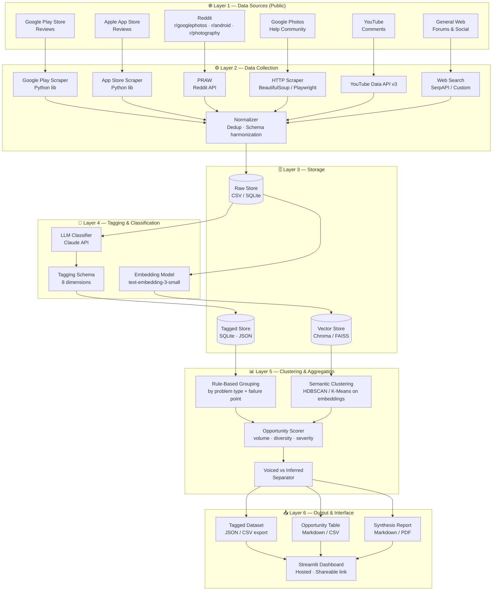
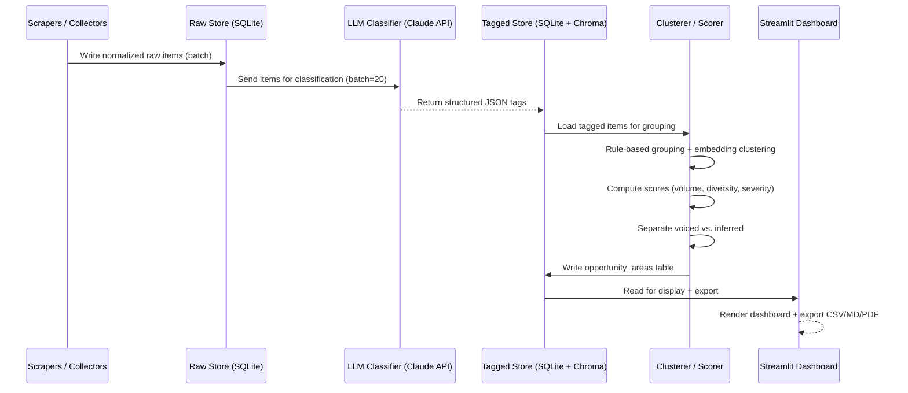
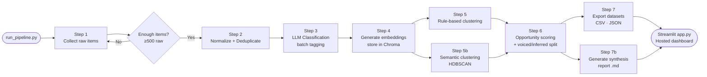

# Architecture — AI-Powered Discovery Engine
### Google Photos Retrieval Research · System Design Document

---

## 1. Overview

The Discovery Engine is a **5-layer agentic pipeline** that ingests public user feedback, classifies and clusters it, and surfaces ranked opportunity areas for the Google Photos Core Experience PM team. It is a **research tool**, not a product feature.

```
┌─────────────────────────────────────────────────────────────────────┐
│                        DISCOVERY ENGINE                             │
│                                                                     │
│  [Data Sources] → [Collector] → [Store] → [Tagger] → [Clusterer]  │
│                                                → [Comparator] → [UI]│
└─────────────────────────────────────────────────────────────────────┘
```

---

## 2. High-Level Architecture Diagram



---

## 3. Layer-by-Layer Design

### Layer 1 — Data Sources

| Source | Access Method | API / Tool | Rate Limit Strategy |
|--------|--------------|------------|---------------------|
| Google Play Store | Public scrape | `google-play-scraper` (Python) | Delay + retry backoff |
| Apple App Store | Public scrape | `app-store-scraper` (Python) | Delay + retry backoff |
| Reddit | Official API | PRAW (`reddit.com/api`) | OAuth2, 60 req/min |
| Google Photos Help Community | HTTP scrape | BeautifulSoup / Playwright | Polite crawl, `robots.txt` respected |
| YouTube | Official API | YouTube Data API v3 | Quota: 10k units/day |
| General Web | Search API | SerpAPI or DuckDuckGo | Targeted queries only |

**Normalization contract** — every collected item is normalized into a shared schema before storage:

```json
{
  "id": "uuid",
  "source": "reddit | play_store | app_store | youtube | help_forum | web",
  "platform_item_id": "original id or url",
  "text": "raw feedback text",
  "date": "ISO 8601 or null",
  "upvotes": 0,
  "url": "permalink",
  "collected_at": "ISO 8601"
}
```

---

### Layer 2 — Data Collection Pipeline

```
run_collectors.py
│
├── collectors/
│   ├── play_store.py        → google-play-scraper
│   ├── app_store.py         → app-store-scraper
│   ├── reddit.py            → PRAW
│   ├── youtube.py           → YouTube Data API v3
│   ├── help_forum.py        → BeautifulSoup / Playwright
│   └── web_search.py        → SerpAPI
│
└── pipeline/
    ├── normalizer.py         → maps each source → shared schema
    ├── deduplicator.py       → hash-based dedup on (source, text[:200])
    └── raw_store.py          → writes to SQLite raw_items table
```

**Target:** 500–1,000 raw items pre-filter, low hundreds to low thousands post-filter.

---

### Layer 3 — Storage Architecture

```
discovery_engine.db (SQLite)
│
├── raw_items          ← raw collected feedback (normalized schema)
├── tagged_items       ← output of LLM classifier (8-dim tags)
├── opportunity_areas  ← named clusters with scores
└── quotes             ← representative verbatim quotes per area

/data/
├── raw_items.csv      ← exportable raw corpus
├── tagged_items.json  ← exportable tagged corpus
└── chroma/            ← vector store for semantic search & clustering
```

> **Why SQLite + Chroma?**  
> SQLite handles structured queries (filter by source, problem type, severity). Chroma handles semantic similarity search over embeddings — enabling discovery of unnamed patterns the rule-based schema might miss.

---

### Layer 4 — Tagging & Classification

Each raw item is sent to the **LLM Classifier** (Claude API) with a structured-output prompt. The classifier returns a JSON object conforming to the 8-dimension tagging schema.

#### Tagging Schema (per item output)

```json
{
  "id": "uuid",
  "relevant": true,
  "problem_types": [
    "search_no_results",
    "cannot_refine"
  ],
  "remembered_cues": ["time_date", "place"],
  "forgotten_cues": ["exact_location"],
  "search_method": "vague_description",
  "failure_points": ["b", "d"],
  "frustration_level": "high",
  "abandoned_app": true,
  "source_platform": "reddit",
  "date": "2024-11-12",
  "upvotes": 47
}
```

#### Problem Type Enum

| Code | Label |
|------|-------|
| `search_no_results` | Search returns irrelevant or no results |
| `screenshots_docs` | Can't find screenshots, documents, or receipts |
| `cannot_refine` | Can't narrow down or refine after failed search |
| `wrong_metadata` | Missing or wrong metadata (date, place, people, objects) |
| `face_recognition` | People / face grouping or recognition problems |
| `sync_backup` | Backup, sync, or storage issue (not true retrieval) |
| `other` | Other / uncategorized |

#### Failure Funnel Enum

| Code | Stage |
|------|-------|
| `a` | Could not express what they remembered in a query |
| `b` | Search did not understand or match the clues given |
| `c` | Results appeared but user could not judge/recognize the right one |
| `d` | Search failed and user had no way to refine or narrow it |

#### Classifier Prompt Design

```
System: You are a UX research analyst tagging user feedback about 
Google Photos search/retrieval failures. Return only valid JSON.

User: Tag the following feedback item according to the schema.
[SCHEMA embedded as JSON schema]
[FEEDBACK TEXT]
```

**Batch processing:** Items processed in batches of 20 to stay within token limits. Failed items are retried up to 3× before being flagged as `classifier_error`.

---

### Layer 5 — Clustering & Opportunity Scoring

Two complementary clustering strategies run in parallel:

#### 5a. Rule-Based Grouping

Groups tagged items by **`(problem_type, failure_point)` combination** into named opportunity areas:

| Opportunity Area | problem_type | failure_point |
|-----------------|-------------|---------------|
| Query Expression Gap | any | `a` |
| Semantic Search Failure | `search_no_results` | `b` |
| Non-Photo Asset Retrieval | `screenshots_docs` | `b`, `d` |
| Post-Search Refinement | `cannot_refine` | `d` |
| Metadata & Context Gaps | `wrong_metadata` | `a`, `b` |
| Face/People Discovery | `face_recognition` | `b`, `c` |

#### 5b. Semantic Clustering (Embedding-Based)

- Items embedded via `text-embedding-3-small` (OpenAI) or equivalent
- HDBSCAN clustering over the embedding space to discover **unnamed patterns** the schema may miss
- Unnamed clusters reviewed manually or by a second LLM pass to assign area labels
- Particularly useful for detecting **INFERRED patterns** (e.g., users describing emotion/purpose-based memory without explicitly asking for it)

#### 5c. Opportunity Scorer

For each opportunity area:

```python
score = {
    "evidence_volume":   count(items_in_area),
    "source_diversity":  len(unique_platforms_in_area),   # max = 6
    "severity_score":    weighted_avg(frustration_level),  # 1/2/3 → low/med/high
    "abandonment_rate":  pct(abandoned_app == True),
    "voiced_count":      count(pattern_type == "voiced"),
    "inferred_count":    count(pattern_type == "inferred"),
    "top_quotes":        [top 3 verbatim quotes by upvote_proxy]
}
```

#### 5d. Voiced vs. Inferred Separator

| Type | Definition | Detection |
|------|-----------|-----------|
| **VOICED** | User explicitly states search fails | LLM tags `relevant=True` + direct complaint phrasing detected |
| **INFERRED** | User describes a memory cue (mood, purpose, person) without asking for that search type | `remembered_cues` contains `emotion/mood` or `purpose` AND no explicit search request in text |

---

### Layer 6 — Output & Interface

#### 6a. Exported Artifacts

| File | Contents |
|------|---------|
| `tagged_items.json` | Full tagged corpus — every item with all 8-dim labels |
| `tagged_items.csv` | Flat CSV version for Excel / Sheets |
| `opportunity_areas.csv` | One row per area: name, volume, diversity, severity, quotes |
| `synthesis_report.md` | 1–2 page narrative: top 3–5 areas, voiced/inferred gap, open Qs |

#### 6b. Streamlit Dashboard (Shareable Link)

```
app.py  (Streamlit)
│
├── Page: Overview
│   └── Opportunity area comparison table (sortable)
│
├── Page: Opportunity Detail
│   ├── Area description + failure funnel heatmap
│   ├── Voiced vs. Inferred breakdown chart
│   └── Representative quotes (filterable by source)
│
├── Page: Raw Corpus Explorer
│   ├── Filter by: source, problem_type, failure_point, severity
│   └── Full-text search over tagged items
│
└── Page: Synthesis Report
    └── Rendered markdown report + PDF export button
```

**Hosting:** Deploy to [Streamlit Community Cloud](https://streamlit.io/cloud) (free, shareable link) or HuggingFace Spaces.

---

## 4. Data Flow Diagram



---

## 5. Project Directory Structure

```
discovery_engine/
│
├── Docs/
│   ├── problemstatement.md
│   └── architecture.md          ← this file
│
├── collectors/
│   ├── __init__.py
│   ├── play_store.py
│   ├── app_store.py
│   ├── reddit.py
│   ├── youtube.py
│   ├── help_forum.py
│   └── web_search.py
│
├── pipeline/
│   ├── __init__.py
│   ├── normalizer.py
│   ├── deduplicator.py
│   ├── raw_store.py
│   ├── tagger.py                ← LLM classifier wrapper
│   ├── embedder.py              ← embedding + Chroma store
│   ├── clusterer.py             ← rule-based + HDBSCAN clustering
│   ├── scorer.py                ← opportunity area scoring
│   └── reporter.py              ← synthesis report generator
│
├── data/
│   ├── raw_items.csv
│   ├── tagged_items.json
│   ├── tagged_items.csv
│   ├── opportunity_areas.csv
│   └── chroma/                  ← vector store
│
├── reports/
│   └── synthesis_report.md
│
├── app.py                        ← Streamlit dashboard entry point
├── run_pipeline.py               ← CLI entrypoint: collect → tag → cluster → report
├── config.py                     ← API keys, batch sizes, thresholds
├── requirements.txt
└── README.md
```

---

## 6. Technology Stack Summary

| Component | Technology | Rationale |
|-----------|-----------|-----------|
| Language | Python 3.11+ | Ecosystem fit; best scraping + ML libs |
| Play Store scraper | `google-play-scraper` | Well-maintained, no auth needed |
| App Store scraper | `app-store-scraper` | Public reviews, no auth |
| Reddit | PRAW | Official API, OAuth2, ToS-compliant |
| YouTube | YouTube Data API v3 | Official, quota-controlled |
| Web scraping | BeautifulSoup + Playwright | Static + JS-rendered pages |
| LLM classifier | Claude API (claude-3-5-haiku) | Structured JSON output, cost-efficient |
| Embeddings | `text-embedding-3-small` (OpenAI) | Fast, cheap, high quality |
| Structured store | SQLite (via `sqlite3` / `pandas`) | Zero-infra, portable, re-queryable |
| Vector store | Chroma | Local-first, easy Python integration |
| Clustering | HDBSCAN (`hdbscan` lib) | Handles variable-density clusters, no k needed |
| Data manipulation | pandas | Grouping, scoring, export |
| Dashboard | Streamlit | Fastest path to shareable hosted link |
| Hosting | Streamlit Community Cloud | Free, public URL, GitHub-connected |

---

## 7. API & Credential Requirements

| API | Env Variable | Where to Get |
|-----|-------------|-------------|
| Claude API | `ANTHROPIC_API_KEY` | console.anthropic.com |
| OpenAI Embeddings | `OPENAI_API_KEY` | platform.openai.com |
| Reddit OAuth | `REDDIT_CLIENT_ID`, `REDDIT_CLIENT_SECRET`, `REDDIT_USER_AGENT` | reddit.com/prefs/apps |
| YouTube Data API v3 | `YOUTUBE_API_KEY` | console.cloud.google.com |
| SerpAPI (optional) | `SERP_API_KEY` | serpapi.com |

> [!CAUTION]
> Never commit API keys to version control. Use a `.env` file + `python-dotenv`. Add `.env` to `.gitignore`.

---

## 8. Pipeline Execution Flow



---

## 9. Key Design Decisions & Rationale

| Decision | Chosen Approach | Alternative Considered | Reason |
|----------|----------------|------------------------|--------|
| Classification method | LLM structured output (Claude) | Keyword rules / regex | Schema is semantic, not keyword-based; LLM handles ambiguity and multi-label |
| Storage | SQLite + Chroma | PostgreSQL / Pinecone | Zero-infra, portable; no server needed for a research tool |
| Clustering | Hybrid (rule + HDBSCAN) | Rule-only or embedding-only | Rule-based = interpretable; semantic = discovers unnamed inferred patterns |
| Hosting | Streamlit Cloud | Local only / Gradio / HuggingFace | Free, shareable URL, GitHub-native deploy |
| Voiced vs. Inferred | LLM tag + heuristic rule | Manual labeling | Scale; must process hundreds to thousands of items |
| Corpus size | 500–1000 raw → hundreds filtered | Smaller sample | Statistical confidence for cross-platform comparison |

---

## 10. Constraints & Guardrails (Architecture Level)

| Constraint | Enforcement |
|-----------|------------|
| Public data only | Each collector checks `robots.txt`; no auth bypass |
| No fabricated quotes | Quotes pulled verbatim from `raw_items.text`; traced by `id` |
| Consistent schema | Single `TaggedItem` Pydantic model enforced across all sources |
| Re-runnability | `run_pipeline.py --from-step <n>` allows resuming from any stage |
| No product design | Pipeline outputs opportunity areas only; no feature spec or wireframe |

---

## 11. Scalability & Extension Points

The pipeline is designed for research scale (low thousands of items) but can be extended:

- **More sources:** Add a new `collectors/<source>.py` implementing the `BaseCollector` interface
- **More LLMs:** Swap classifier by changing `config.py → CLASSIFIER_MODEL`
- **Larger corpus:** Replace SQLite with PostgreSQL; Chroma with Pinecone or Weaviate
- **Continuous re-running:** Add a scheduler (cron / Airflow) to periodically re-collect and re-tag

---

*This architecture document is a living design reference. Update as implementation decisions are made.*
