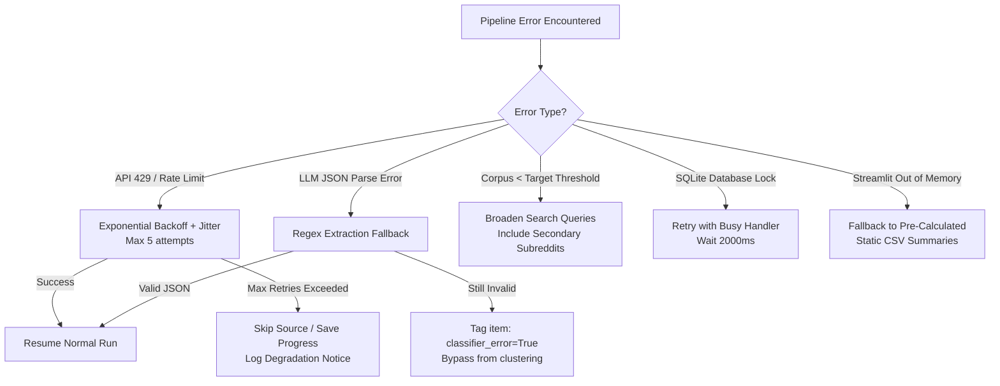

# Edge Cases & Failure Modes — AI-Powered Discovery Engine
### Google Photos Retrieval Research · Robustness & Resiliency Guide

---

## 1. Overview

This document catalogs critical **edge cases, failure modes, data ambiguities, and system resilience strategies** across all layers of the AI-Powered Discovery Engine. 

Because this system processes unstructured public web data and relies on non-deterministic LLM evaluation, defensive engineering is required to ensure:
1. **Data integrity** (no fabricated quotes, ungrounded numbers, or poisoned metrics).
2. **Pipeline resilience** (graceful degradation without stopping long-running batch jobs).
3. **Rigorous classification** (distinguishing true retrieval failures from storage/backup bugs).

---

## 2. Edge Case Summary Matrix

| ID | Layer | Edge Case Category | Likelihood | Impact | Primary Mitigation |
|---|---|---|---|---|---|
| **EC-01** | Layer 1/2 | Anti-scraping, CAPTCHA & 429/403 rate limits | High | High | Exponential backoff, jitter, rotating user-agents, API-first fallback |
| **EC-02** | Layer 1/2 | YouTube API quota depletion (10,000 unit cap) | High | Medium | Hard-capped queries, local cache of comment threads |
| **EC-03** | Layer 1/2 | Non-English & multilingual user feedback | Medium | Medium | Language detection; translate or filter with audit log |
| **EC-04** | Layer 1/2 | Ultra-short text, single emojis, or spam / bots | High | Low | Pre-normalization quality filter (min character/word threshold) |
| **EC-05** | Layer 1/2 | Extreme text length (forum essays > 4,000 tokens) | Low | Medium | Chunking with retrieval-salient context preservation |
| **EC-06** | Layer 3 | SQLite write locks during parallel scraping/tagging | Medium | High | WAL mode (`PRAGMA journal_mode=WAL`), centralized writer queue |
| **EC-07** | Layer 3 | Near-duplicate posts across syndicated forums/cross-posts | Medium | Medium | MinHash / Levenshtein similarity dedup beyond exact hashing |
| **EC-08** | Layer 4 | Sync/Backup/Storage complaints disguised as retrieval failures | High | Critical | Negative-cue validation in prompt; strict `relevant=False` tagging |
| **EC-09** | Layer 4 | Hallucinated cues (LLM assumes date/place not in text) | Medium | High | Chain-of-Thought extraction + strict verbatim citation checks |
| **EC-10** | Layer 4 | Malformed JSON / partial streaming disconnects | Medium | Medium | Pydantic strict parsing, retry backoff with temperature=0.0 |
| **EC-11** | Layer 4 | Sarcasm, irony, and rhetorical questions | Medium | Medium | Few-shot classification examples covering idiomatic phrasing |
| **EC-12** | Layer 5 | HDBSCAN noise cluster (`cluster_id = -1`) dominance | High | Medium | Secondary classification pass; fallback to rule-based hierarchy |
| **EC-13** | Layer 5 | Extreme platform score skew (e.g. viral Reddit post with 15k upvotes) | High | High | Logarithmic normalization of engagement/upvote proxies |
| **EC-14** | Layer 5 | Voiced vs. Inferred misattribution | Medium | High | Rule verification checking for explicit query keywords |
| **EC-15** | Layer 6 | Streamlit UI memory exhaustion & cold starts | Medium | Medium | Pre-aggregated parquet/CSV storage; lazy loading of vector DB |
| **EC-16** | Layer 6 | Markdown/HTML injection via raw verbatim quotes | Low | Medium | HTML entity escaping before rendering in Streamlit or PDF |

---

## 3. Layer 1 & 2: Data Sources & Collection Edge Cases

### EC-01: Rate Limiting & Anti-Scraping Blocks (HTTP 429, 403, Cloudflare)
- **Scenario:** Google Play, App Store, or Google Help Community detects automated scrapers and returns 429 (Too Many Requests), 403 (Forbidden), or CAPTCHA challenges.
- **Consequence:** Pipeline crashes mid-collection; dataset is skewed toward platforms that did not block.
- **Handling Strategy:**
  - Implement randomized delay intervals ($2.0s \pm 0.8s$) with jitter between requests.
  - Set realistic `User-Agent` strings matching standard desktop/mobile browsers.
  - Implement Tenacity retry handler:
    ```python
    @retry(
        stop=stop_after_attempt(5),
        wait=wait_exponential(multiplier=1.5, min=2, max=30),
        retry=retry_if_exception_type((HTTPError, ConnectionError))
    )
    def fetch_with_retry(url, headers): ...
    ```
  - If a source remains blocked after max retries, flag that source as `DEGRADED`, alert the operator, save current progress, and continue collecting other sources.

### EC-02: YouTube API Quota Exhaustion
- **Scenario:** The YouTube Data API v3 has a strict free limit of 10,000 units/day. Video search costs 100 units; comment list calls cost 1 unit each.
- **Consequence:** `run_collectors.py` fails halfway through YouTube scraping with `quotaExceeded`.
- **Handling Strategy:**
  - Budget YouTube calls strictly: maximum 5 search queries (500 units) + maximum 50 comment page requests (50 units) = 550 units total (~5.5% of daily quota).
  - Cache API responses to disk (`data/cache/youtube/`) keyed by video ID to prevent repeated queries during re-runs.

### EC-03: Non-English & Mixed-Language Feedback
- **Scenario:** Play Store and App Store reviews often contain Spanish, Portuguese, Hindi, German, Japanese, etc. (e.g., *"No encuentro mis fotos de hace un año"*).
- **Consequence:** The LLM classifier may produce inconsistent English label mappings, or English-trained embedding models (`text-embedding-3-small`) may cluster non-English texts into language-specific clusters rather than semantic problem-type clusters.
- **Handling Strategy:**
  - Run language detection (`langdetect` or `fasttext`) on normalized text.
  - Record `detected_language`.
  - For non-English text:
    - *Option A (Default):* Translate to English via LLM translation pass or Google Translate API before tagging and embedding, keeping `original_text` intact.
    - *Option B:* Isolate non-English items with tag `language != 'en'` and analyze language parity in metadata.

### EC-04: Low-Quality, Ultra-Short, and Bot Content
- **Scenario:** Items containing only:
  - 1–3 words: *"Photos gone"*, *"Update sucks"*, *"Good app"*
  - Single emojis: 😡👎💔
  - Generic spam: links to WhatsApp mods, fake customer care phone numbers.
- **Consequence:** LLM wastes tokens classifying noise; vector store clusters meaningless single-word items.
- **Handling Strategy:**
  - Add strict pre-normalization validation rules in `collectors/base.py`:
    - Discard items where `len(text.strip()) < 35` characters.
    - Discard items where alpha characters make up `< 50%` of the total length.
    - Discard items containing known spam patterns (e.g. regex for phone numbers, WhatsApp invite links).
  - Log discarded items count to `data/collection_discarded_audit.log`.

### EC-05: Extremely Long Posts / Forum Multi-Issue Rants
- **Scenario:** A user writes an 8-paragraph post detailing their entire history with Android, storage upgrades, Google Drive, and incidentally mentions failing to search for a receipt in line 45.
- **Consequence:** LLM context limit or token budget inflated; prompt focus diluted; multiple conflicting issues confuse the classifier.
- **Handling Strategy:**
  - Cap input length at 2,000 characters for classification.
  - If text exceeds 2,000 characters, extract the most relevant window: search for sentence blocks containing retrieval keywords (`search`, `find`, `look for`, `lost`, `remember`, `where is`) and take 1,000 characters surrounding the match.

---

## 4. Layer 3: Storage & Vector Store Edge Cases

### EC-06: SQLite Database Locking & Concurrency
- **Scenario:** Multiple collector workers or parallel tagging threads attempt simultaneous writes to `discovery_engine.db`.
- **Consequence:** `sqlite3.OperationalError: database is locked`.
- **Handling Strategy:**
  - Enable Write-Ahead Logging immediately upon database creation:
    ```sql
    PRAGMA journal_mode=WAL;
    PRAGMA busy_timeout=5000;
    PRAGMA synchronous=NORMAL;
    ```
  - Restrict write operations to batch inserts managed by a single database manager instance (`pipeline/raw_store.py`).

### EC-07: Near-Duplicate Feedback & Cross-Posting
- **Scenario:** The same user posts the identical complaint to both `r/googlephotos` and `r/android`, or multiple users copy-paste a known template complaint on Play Store after an update.
- **Consequence:** False inflation of `evidence_volume` and distorted platform diversity metrics.
- **Handling Strategy:**
  - **Level 1 (Exact):** SHA-256 hash of normalized text (lowercase, whitespace stripped).
  - **Level 2 (Near-duplicate):** For items with cosine similarity $> 0.92$ in Chroma, check token Jaccard similarity. If $> 0.85$, tag the newer item with `duplicate_of = <original_id>` and exclude it from primary volume counts while recording it in cross-platform resonance metrics.

---

## 5. Layer 4: Tagging & Classification Edge Cases

### EC-08: False Positives — Sync/Backup/Loss vs. Retrieval Failures (CRITICAL)
- **Scenario:** 
  - *"I backed up my phone and half my photos from 2021 are completely gone from the cloud!"*
  - *"Google deleted my photos after my storage reached 15GB!"*
- **The Trap:** A naive keyword search for "can't find my photos" will capture thousands of sync/backup/storage complaints. These are **infrastructure/storage** issues, NOT search/retrieval failures.
- **Consequence:** If not filtered, the entire discovery engine's output will falsely conclude that "photos disappearing after backup" is the #1 search opportunity area.
- **Handling Strategy:**
  - Explicitly train the LLM prompt with disambiguation rules:
    ```
    DISAMBIGUATION RULE:
    - If the user cannot find photos because files were NEVER synced, were deleted, 
      are missing from Google Drive, or disappeared due to cloud backup failure:
      TAG relevant = false, problem_types = ["sync_backup"].
    - ONLY tag relevant = true if the photo IS assumed to exist in the user's library, 
      but the user cannot LOCATE or RETRIEVE it through search, browsing, or filtering.
    ```
  - Unit test the classifier on a golden set of 20 ambiguous edge cases before running on the full corpus.

### EC-09: LLM Hallucination of Remembered Cues
- **Scenario:** A user says *"I can't find that photo of the blue car."* The LLM outputs `remembered_cues: ["object_detail", "time_date", "place"]` because it assumes cars exist at a time and place.
- **Consequence:** Corrupts cue-level analysis (e.g. falsely inflating how often users remember dates).
- **Handling Strategy:**
  - Enforce grounding in the prompt:
    ```
    GROUNDING RULE:
    Only select cues that are EXPLICITLY stated in the text. 
    Do NOT infer unmentioned cues. For each cue you tag, 
    you must be able to cite the exact words from the feedback.
    ```
  - Validate with Pydantic: if `time_date` is tagged, check if any temporal words exist in the raw text (e.g., *yesterday, 2022, summer, october, years ago, when*). If none exist, strip the tag.

### EC-10: LLM Output Formatting Failures & JSON Disconnects
- **Scenario:** LLM outputs markdown formatting around JSON (` ```json ... ``` `), prefixes output with conversational preamble (*"Here is the classification:"*), or network cuts out mid-generation resulting in truncated JSON.
- **Consequence:** Script throws JSONDecodeError, crashing the batch loop.
- **Handling Strategy:**
  - Use regex to extract the outermost JSON block:
    ```python
    match = re.search(r"\{.*\}", response_text, re.DOTALL)
    ```
  - Parse through Pydantic with fallback:
    ```python
    try:
        tagged = TaggedItem.model_validate_json(raw_json_str)
    except ValidationError as e:
        # Fallback to repair pass or record item with classifier_error = True
    ```
  - Set `temperature = 0.0` for maximum JSON adherence and deterministic classification.

### EC-11: Sarcasm, Rhetorical Questions, and Idiomatic Phrasing
- **Scenario:** 
  - *"Great job Google, search works so amazingly well that typing 'dog' gives me my tax returns."*
  - *"Is it just me or does Google Photos search have dementia lately?"*
- **Consequence:** Sentiment analysis flags *"Great job"* as positive; literal classifiers miss the failure point.
- **Handling Strategy:**
  - Instruct the model: *"Analyze semantic intent and pragmatic meaning. Detect sarcastic or ironic expressions of frustration and classify frustration_level as 'high'."*
  - Include this exact sarcastic tax-return example in the few-shot prompt section.

---

## 6. Layer 5: Clustering & Scoring Edge Cases

### EC-12: The "Noise" Cluster in HDBSCAN (`cluster_id = -1`)
- **Scenario:** HDBSCAN assigns outliers to label `-1`. If text embeddings are heterogeneous, 40–60% of items may be marked as noise.
- **Consequence:** High volume of real user evidence is discarded from opportunity areas.
- **Handling Strategy:**
  - Treat HDBSCAN as an **exploratory secondary layer**, not the sole grouping mechanism.
  - Primary clustering is deterministic rule-based mapping (`problem_types` $\times$ `failure_points`).
  - For items in HDBSCAN noise (`-1`), calculate cosine similarity against centroids of discovered clusters; if similarity $\ge 0.78$, assign to the nearest cluster; otherwise retain in `"Uncategorized Long-Tail"`.

### EC-13: Upvote / Engagement Metric Skew Across Platforms
- **Scenario:** 
  - A Reddit thread on `r/android` has **4,200 upvotes**.
  - A Google Play review has **12 helpful votes**.
  - A Help Forum post has **3 "I have this question too" clicks**.
- **Consequence:** If raw engagement numbers are summed, a single Reddit thread will drown out hundreds of App Store/Play Store reviews.
- **Handling Strategy:**
  - **Normalized Impact Score:** Log-transform engagement per platform rather than raw sums:
    $$\text{EngagementWeight} = 1 + \ln(1 + \text{upvotes})$$
  - Cap maximum single-item weight at $10.0$ to prevent viral posts from monopolizing opportunity area rankings.
  - Require **Source Diversity $\ge 2$** platforms before any opportunity area can be ranked in the top 3.

### EC-14: Voiced vs. Inferred Misclassification
- **Scenario:** A user writes: *"I wanted to show my friend that hilarious meme I saved when we were hanging out at the beach, but I couldn't find it."*
  - *Voiced element:* None (they didn't say "the search algorithm failed").
  - *Inferred element:* They remembered **emotion/humor** (*"hilarious"*) + **social context** (*"hanging out with friend"*) + **location** (*"beach"*), but couldn't retrieve a **non-photo asset** (*meme*).
- **Consequence:** Naive classifiers look for negative search verbs and tag this as irrelevant or generic complaint.
- **Handling Strategy:**
  - Separate detection into explicit logical checks:
    ```python
    def detect_voiced_vs_inferred(item, text):
        explicit_search_terms = ["search", "query", "filter", "results", "algorithm", "typed"]
        has_explicit_term = any(term in text.lower() for term in explicit_search_terms)
        
        has_rich_cues = any(cue in ["emotion", "purpose", "event", "people_present"] 
                            for cue in item.remembered_cues)
                            
        if has_rich_cues and not has_explicit_term:
            return "inferred"
        return "voiced"
    ```

---

## 7. Layer 6: Interface, Visualization & Export Edge Cases

### EC-15: Streamlit Memory Leaks & Large Dataset Freezes
- **Scenario:** Loading raw SQLite + Chroma + full Pandas dataframes on every user filter interaction causes Streamlit session state memory to exceed 1GB, causing container crashes on Streamlit Cloud (1GB RAM limit).
- **Consequence:** App crashes with `ResourceExhausted` or becomes unresponsive.
- **Handling Strategy:**
  - Pre-aggregate opportunity areas and KPI metrics into compact static JSON/CSV files during pipeline execution.
  - Use `@st.cache_data` with time-to-live (`ttl=3600`) and max entries:
    ```python
    @st.cache_data(max_entries=5)
    def load_opportunity_summary():
        return pd.read_csv("data/opportunity_areas.csv")
    ```
  - In the "Corpus Explorer" page, implement SQL-level pagination (`LIMIT 50 OFFSET ?`) instead of loading all thousands of items into Streamlit memory at once.

### EC-16: HTML / Markdown / XSS Injection via User Quotes
- **Scenario:** A raw review scraped from Reddit contains formatting characters, raw HTML (`<script>`, `<style>`), or Markdown syntax (e.g. unclosed backticks, headers, links).
- **Consequence:** Corrupts the Streamlit UI layout or breaks PDF compilation in `reports/synthesis_report.md`.
- **Handling Strategy:**
  - Sanitize all verbatim quotes before rendering:
    ```python
    import html

    def sanitize_quote(text: str) -> str:
        # Strip raw HTML tags
        clean_text = html.escape(text.strip())
        # Prevent markdown link hijacking
        clean_text = clean_text.replace("[", "\\[").replace("]", "\\]")
        return clean_text
    ```

### EC-17: Empty State / Zero Filter Results in UI
- **Scenario:** A user selects filters: `Platform = YouTube`, `Failure Point = c`, `Frustration = Low`, resulting in 0 matching items.
- **Consequence:** Streamlit displays blank charts or throws `IndexError: single positional indexer is out-of-bounds`.
- **Handling Strategy:**
  - Check for empty dataframe before passing to Plotly charts:
    ```python
    if filtered_df.empty:
        st.info("ℹ️ No feedback items match the selected combination of filters. Try broadening your criteria.")
        st.stop()
    ```

---

## 8. Automated Recovery & Degradation Matrix



---

## 9. Pre-Flight Verification Checklist

Before running the full production pipeline or sharing the dashboard link, verify all edge cases:

- [ ] **Data Cleansing:** Run a test scrape of 20 items and verify no single-word, emoji-only, or spam items enter `raw_items`.
- [ ] **Disambiguation Guardrail:** Run 10 known sync/backup complaint examples through `tagger.py` and confirm `relevant == False` in 100% of cases.
- [ ] **JSON Adherence:** Confirm `tagger.py` runs with `temperature = 0.0` and handles truncated responses gracefully.
- [ ] **Engagement Normalization:** Verify that a Reddit post with 2,000 upvotes does not count as 2,000 Play Store reviews.
- [ ] **Verbatim Quote Provenance:** Pick 5 random quotes from `opportunity_areas.csv` and verify their exact text and ID exist in `raw_items.csv`.
- [ ] **Sanitization:** Verify that quotes with special characters (`<`, `>`, `"`, `*`, `_`) render safely in both Streamlit and markdown exports.
- [ ] **Empty States:** Test the Streamlit UI with impossible filter combinations and verify user-friendly warning messages.
