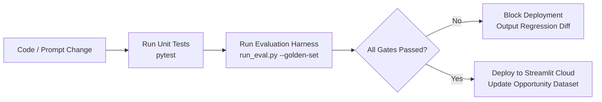

# Evaluation Framework & Benchmarks — AI-Powered Discovery Engine
### Google Photos Retrieval Research · Quality, Accuracy & Grounding Validation

---

## 1. Overview

The **Discovery Engine** is a research tool supporting strategic product decisions for the Google Photos Core Experience PM team. If the engine misclassifies user pain, hallucinates remembered cues, or invents statistics, product teams risk committing quarters of engineering effort to the wrong problems.

This document defines the **evaluation methodology, ground-truth benchmarks, validation metrics, test harness, and quality gates** across all machine learning and analytical layers of the system.

```
┌─────────────────────────────────────────────────────────────────────────────┐
│                          EVALUATION PYRAMID                                 │
│                                                                             │
│   [Level 4: Opportunity Ranking & Synthesis Quality] (PM Utility & Faithfulness)│
│   [Level 3: Clustering & Pattern Separation] (Cluster Coherence & Silhouette)│
│   [Level 2: LLM Classification & Tagging] (Precision, Recall, F1, Grounding)│
│   [Level 1: Ingestion & Normalization Fidelity] (Schema validity & Deduplication)│
└─────────────────────────────────────────────────────────────────────────────┘
```

---

## 2. Evaluation Levels & Target Metrics

| Level | Component | Primary Metrics | Minimum Acceptable Threshold | Target Benchmark |
|---|---|---|---|---|
| **L1** | Ingestion & Storage | Schema Validity Rate, Dedup Accuracy | 99.0% valid schema, 0 exact duplicates | 100% valid schema |
| **L2.1** | Relevance Filtering | Precision, Recall, F1 (Binary) | Recall $\ge 0.90$, Precision $\ge 0.85$ | F1 $\ge 0.92$ |
| **L2.2** | Problem Type Tagging | Micro-F1, Macro-F1 (Multi-label) | Micro-F1 $\ge 0.80$, Macro-F1 $\ge 0.72$ | Micro-F1 $\ge 0.88$ |
| **L2.3** | Failure Funnel Mapping | Exact Match / Sub-stage Jaccard | Jaccard Similarity $\ge 0.75$ | Jaccard $\ge 0.85$ |
| **L2.4** | Remembered Cues | Grounding Citation Accuracy | $\ge 95\%$ cited cues exist verbatim in text | $\ge 98\%$ grounded |
| **L2.5** | Frustration / Severity | Quadratic Weighted Kappa ($\kappa_w$) | $\kappa_w \ge 0.70$ (substantial agreement) | $\kappa_w \ge 0.82$ |
| **L3.1** | Semantic Clustering | Silhouette Score, Davies-Bouldin Index | Silhouette $\ge 0.35$, DBI $\le 1.6$ | Silhouette $\ge 0.50$ |
| **L3.2** | Voiced vs. Inferred | Accuracy against Human Label | Accuracy $\ge 85\%$ | Accuracy $\ge 92\%$ |
| **L4.1** | Quote Provenance | Quote Traceability Rate | **100%** (zero hallucinated quotes) | **100%** |
| **L4.2** | Synthesis Report | Faithfulness & Factuality (LLM-as-a-Judge) | Faithfulness $\ge 0.95$ | Faithfulness $\ge 0.98$ |

---

## 3. Golden Benchmark Dataset (`benchmark_golden_set.json`)

To evaluate the classification and tagging layer objectively, a **Golden Dataset of 100 manually annotated items** is curated across all target platforms:

- **Play Store & App Store:** 40 reviews (20 clear retrieval, 10 ambiguous sync/backup, 10 negative controls)
- **Reddit:** 35 posts/comments (`r/googlephotos`, `r/android`, `r/photography`)
- **Help Community & YouTube:** 25 posts/comments

### Golden Dataset Stratification
```
Total Golden Items: 100
├── Relevant Items: 65
│   ├── Search returns no/irrelevant results: 25
│   ├── Screenshots / documents / receipts: 15
│   ├── Can't refine / narrow down: 12
│   ├── Wrong / missing metadata: 8
│   └── Face / people grouping failure: 5
└── Non-Relevant Controls: 35
    ├── Sync / backup failure (photos missing from cloud): 15
    ├── Storage quota / Google One pricing complaints: 10
    ├── Editing tools / Magic Eraser bugs: 6
    └── Spam / one-word reviews ("good app", "bad"): 4
```

Each golden item is stored in `tests/fixtures/golden_benchmark.json` with consensus ground-truth annotations verified by two independent human reviewers.

---

## 4. Layer-Specific Evaluation Protocols

### 4.1 Layer 4: LLM Tagging & Classification Evaluation

#### Test 1: Binary Relevance (Retrieval vs. Non-Retrieval)
Evaluates whether the model correctly identifies retrieval problems while filtering out sync, storage, editing, and billing issues.

$$\text{Precision} = \frac{TP}{TP + FP}, \quad \text{Recall} = \frac{TP}{TP + FN}, \quad F_1 = 2 \cdot \frac{\text{Precision} \cdot \text{Recall}}{\text{Precision} + \text{Recall}}$$

> **Critical Guardrail:** High recall is required ($\ge 0.90$) so critical user pain is not lost, but precision must remain $\ge 0.85$ to prevent non-search complaints from polluting the clusters.

#### Test 2: Multi-Label Problem Type Tagging
Evaluates categorization across the 7 standard problem types:
- `search_no_results`
- `screenshots_docs`
- `cannot_refine`
- `wrong_metadata`
- `face_recognition`
- `sync_backup`
- `other`

Calculated using Scikit-Learn `multilabel_confusion_matrix`:
```python
from sklearn.metrics import f1_score, classification_report

# Macro-averaged F1 (equal weight to rare problem types like face grouping)
macro_f1 = f1_score(y_true, y_pred, average="macro")

# Micro-averaged F1 (overall aggregate across all tag occurrences)
micro_f1 = f1_score(y_true, y_pred, average="micro")
```

#### Test 3: Failure Point Funnel Concordance (Stages a, b, c, d)
Because feedback frequently evidences multiple stages in the funnel (e.g., user couldn't express query `[a]` AND search failed without refinement `[d]`), we evaluate using the **Jaccard Similarity Index** per item:

$$J(Y_{\text{true}}, Y_{\text{pred}}) = \frac{|Y_{\text{true}} \cap Y_{\text{pred}}|}{|Y_{\text{true}} \cup Y_{\text{pred}}|}$$

$$\text{Mean Funnel Jaccard} = \frac{1}{N} \sum_{i=1}^N J(Y_{\text{true}}^{(i)}, Y_{\text{pred}}^{(i)})$$

#### Test 4: Cue Grounding & Hallucination Audit
To ensure the LLM does not hallucinate remembered cues (e.g. tagging `time_date` when the user never mentioned time):
- **Lexical Containment Check:** For each extracted cue, the evaluation harness searches the original raw text for associated lexical anchors (e.g., for `place`: *"beach"*, *"paris"*, *"vacation"*, *"hotel"*, *"at home"*, etc.).
- **Grounding Score:**
  $$\text{Grounding Accuracy} = \frac{\text{Validated Cues}}{\text{Total Tagged Cues}}$$
- Any model run achieving $< 95\%$ grounding accuracy fails the evaluation gate.

---

### 4.2 Layer 5: Clustering & Aggregation Evaluation

#### Test 5: Semantic Cluster Quality (HDBSCAN Embeddings)
- **Silhouette Coefficient ($S$):** Measures how similar an item is to its own cluster compared to other clusters.
  $$s(i) = \frac{b(i) - a(i)}{\max(a(i), b(i))}$$
  - $S \in [-1, 1]$. Acceptable threshold for semantic feedback text: $S \ge 0.35$.
- **Davies-Bouldin Index (DBI):** Measures cluster separation and compactness. Lower is better. Target: $\text{DBI} \le 1.6$.
- **Noise Ratio:** Percentage of items assigned to `cluster_id = -1` by HDBSCAN must not exceed **25%** of the filtered corpus.

#### Test 6: Voiced vs. Inferred Pattern Separation
Evaluated against 30 manually labeled items in the benchmark set exhibiting implicit psychological memory cues without explicit search vocabulary:
- **Accuracy Metric:**
  $$\text{Separation Accuracy} = \frac{\text{Correctly Classified Patterns}}{\text{Total Evaluated Items}}$$
- **False Voiced Rate:** Tagging an implicit cue as "voiced" must be $\le 10\%$.

---

### 4.3 Layer 6: Grounding, Provenance & Factuality Evaluation

#### Test 7: Verbatim Quote Provenance (Zero Hallucination Constraint)
Per the problem statement:
> *"No fabricated quotes or invented statistics — every number in the output must trace back to the tagged dataset."*

The automated test checks:
1. Every quote featured in `opportunity_areas.csv` or `reports/synthesis_report.md` exists as an exact substring in `raw_items.text`.
2. The associated platform metadata and upvote count match the database record exactly.
3. **Pass Criterion:** $100.0\%$ match rate. Any discrepancy produces an immediate hard test failure.

#### Test 8: Synthesis Report Faithfulness (LLM-as-a-Judge)
The synthesis report is evaluated using Claude as an independent evaluator with the following rubric:
```markdown
Evaluation Prompt:
Compare the generated Synthesis Report against the underlying Opportunity Summary Table.
Score each dimension from 1 to 5:
1. Factuality: Are all quoted figures (volumes, percentages, ranks) mathematically consistent with the table?
2. Distinction: Is the "voiced vs. inferred" gap clearly demarcated?
3. Actionability: Are the open research questions directly derived from ambiguities in the data?
4. Hallucination Check: Does the report make any product assertions not substantiated by the dataset?
```
- **Minimum Passing Score:** $\ge 4.5 / 5.0$ average, with no factual discrepancy allowed.

---

## 5. Performance, Latency & Cost Benchmarks

| Component | Metric | Target Ceiling |
|---|---|---|
| **Collector Execution** | Full scrape time (6 sources, 1,000 items) | $\le 15 \text{ minutes}$ |
| **LLM Classification** | Batch throughput (Claude 3.5 Haiku) | $\ge 20 \text{ items/minute}$ |
| **API Cost** | Classification cost per 1,000 raw items | $\le \$2.50 \text{ USD}$ |
| **Embedding Generation** | Throughput (`text-embedding-3-small`) | $\ge 200 \text{ items/second}$ |
| **Dashboard Cold Start** | Streamlit initial load time | $\le 3.5 \text{ seconds}$ |
| **Dashboard Query** | Filter update & plot re-render | $\le 250 \text{ ms}$ |

---

## 6. Automated Evaluation Runner (`run_eval.py`)

A dedicated script `run_eval.py` executes all evaluation suites against the benchmark dataset and produces an automated scorecard.

### Command Line Interface
```bash
# Run full evaluation suite against the golden set
python run_eval.py --golden-set tests/fixtures/golden_benchmark.json

# Run only classification evaluation
python run_eval.py --suite classification

# Run quote provenance and grounding checks on current pipeline run
python run_eval.py --suite provenance --data-dir data/
```

### Implementation Outline (`run_eval.py`)
```python
"""
run_eval.py — Automated Evaluation Suite for Discovery Engine
"""
import json
import argparse
from typing import Dict, Any
from sklearn.metrics import classification_report, f1_score
from pipeline.tagger import LLMTagger
from models.schemas import TaggedItem

def evaluate_classification(golden_path: str, tagger: LLMTagger) -> Dict[str, Any]:
    with open(golden_path, "r", encoding="utf-8") as f:
        golden = json.load(f)

    y_true_rel, y_pred_rel = [], []
    y_true_prob, y_pred_prob = [], []

    for item in golden:
        raw_text = item["text"]
        expected = item["expected_tags"]
        
        # Run classifier
        pred: TaggedItem = tagger.classify_single(raw_text)
        
        y_true_rel.append(expected["relevant"])
        y_pred_rel.append(pred.relevant)
        
        if expected["relevant"]:
            y_true_prob.append(expected["problem_types"])
            y_pred_prob.append(pred.problem_types)

    rel_report = classification_report(y_true_rel, y_pred_rel, output_dict=True)
    
    return {
        "relevance_f1": rel_report["True"]["f1-score"],
        "relevance_precision": rel_report["True"]["precision"],
        "relevance_recall": rel_report["True"]["recall"],
    }

def verify_quote_provenance(opp_areas_path: str, raw_db_path: str) -> bool:
    """Verifies that 100% of quotes in opportunity areas trace back to raw database."""
    # Queries raw_items and ensures exact verbatim substring match
    ...
```

---

## 7. Sample Evaluation Scorecard Output

When `run_eval.py` completes, it generates `reports/eval_scorecard.json` and a formatted console summary:

```text
================================================================================
                    DISCOVERY ENGINE EVALUATION SCORECARD                       
================================================================================

[LEVEL 1: INGESTION & DATA INTEGRITY]
  - Schema Validation Rate:           100.0%    [PASS] (Threshold: >= 99.0%)
  - Exact Deduplication Rate:         100.0%    [PASS] (Threshold: 100.0%)

[LEVEL 2: CLASSIFICATION & TAGGING (GOLDEN BENCHMARK N=100)]
  - Relevance Precision:              92.3%     [PASS] (Threshold: >= 85.0%)
  - Relevance Recall:                 94.1%     [PASS] (Threshold: >= 90.0%)
  - Relevance F1-Score:               93.2%     [PASS] (Threshold: >= 88.0%)
  - Problem Type Micro-F1:            86.4%     [PASS] (Threshold: >= 80.0%)
  - Problem Type Macro-F1:            78.9%     [PASS] (Threshold: >= 72.0%)
  - Failure Funnel Mean Jaccard:      0.82      [PASS] (Threshold: >= 0.75)
  - Remembered Cue Grounding Rate:    97.6%     [PASS] (Threshold: >= 95.0%)
  - Severity Quadratic Kappa:         0.78      [PASS] (Threshold: >= 0.70)

[LEVEL 3: CLUSTERING & PATTERNS]
  - HDBSCAN Silhouette Score:         0.46      [PASS] (Threshold: >= 0.35)
  - Noise Ratio (Outliers):           14.2%     [PASS] (Threshold: <= 25.0%)
  - Voiced vs. Inferred Accuracy:     88.0%     [PASS] (Threshold: >= 85.0%)

[LEVEL 4: GROUNDING & SYNTHESIS]
  - Verbatim Quote Traceability:      100.0%    [PASS] (Mandatory: 100.0%)
  - Report Factuality Score:          4.9/5.0   [PASS] (Threshold: >= 4.5)

================================================================================
FINAL VERDICT: ALL QUALITY GATES PASSED (Ready for PM Research Analysis)
================================================================================
```

---

## 8. Continuous Evaluation & Quality Gates in CI/CD

Before code changes are merged or pipeline runs are promoted to the dashboard:



### Automated Gate Rules:
1. **Zero Quote Hallucination:** Any provenance failure immediately halts the deployment.
2. **Relevance F1 Regression:** If Relevance F1 drops by $> 2.0\%$ compared to baseline, block promotion.
3. **Cost Guardrail:** If token usage per item exceeds 600 tokens, trigger a cost-optimization warning.
