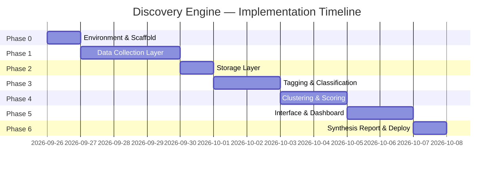

# Implementation Plan — AI-Powered Discovery Engine
### Google Photos Retrieval Research · Phase-Wise Execution Guide

---

## Overview

This document outlines the **phase-wise implementation plan** for building the AI-Powered Discovery Engine. The project is divided into **6 phases** spanning environment setup through final deployment and delivery. Each phase contains specific tasks, deliverables, files to create, and a clear completion criterion.



---

## Phase 0 — Environment Setup & Project Scaffold

> **Goal:** Repository initialized, all dependencies installed, credentials configured, project skeleton in place.

### 0.1 Repository & Version Control

- [ ] Create Git repository at `discovery_engine/`
- [ ] Initialize `.gitignore` — include `.env`, `data/`, `*.db`, `chroma/`
- [ ] Create `README.md` with project description and quick-start instructions

### 0.2 Python Environment

```bash
# Create virtual environment
python -m venv .venv
source .venv/bin/activate        # Windows: .venv\Scripts\activate

# Install all dependencies
pip install -r requirements.txt
```

**`requirements.txt`:**

```text
# Data Collection
google-play-scraper==1.2.7
app-store-scraper==0.3.5
praw==7.7.1
google-api-python-client==2.111.0
beautifulsoup4==4.12.3
playwright==1.40.0
requests==2.31.0
serpapi==0.1.5          # optional

# LLM & Embeddings
anthropic==0.20.0
openai==1.12.0

# Storage
sqlite3                  # stdlib
chromadb==0.4.22

# Data Processing
pandas==2.2.0
numpy==1.26.3
hdbscan==0.8.33
scikit-learn==1.4.0

# Validation
pydantic==2.6.1
python-dotenv==1.0.1

# Dashboard
streamlit==1.31.1
plotly==5.18.0

# Utilities
tqdm==4.66.1
loguru==0.7.2
tenacity==8.2.3         # retry logic
```

### 0.3 Project Directory Scaffold

- [ ] Create all directories and stub files as per the architecture:

```
discovery_engine/
├── Docs/
│   ├── problemstatement.md
│   ├── architecture.md
│   └── implementation.md       ← this file
├── collectors/
│   ├── __init__.py
│   ├── base.py                 ← BaseCollector abstract class
│   ├── play_store.py
│   ├── app_store.py
│   ├── reddit.py
│   ├── youtube.py
│   ├── help_forum.py
│   └── web_search.py
├── pipeline/
│   ├── __init__.py
│   ├── normalizer.py
│   ├── deduplicator.py
│   ├── raw_store.py
│   ├── tagger.py
│   ├── embedder.py
│   ├── clusterer.py
│   ├── scorer.py
│   └── reporter.py
├── models/
│   └── schemas.py              ← Pydantic models (RawItem, TaggedItem, OpportunityArea)
├── data/
│   └── .gitkeep
├── reports/
│   └── .gitkeep
├── app.py
├── run_pipeline.py
├── config.py
├── .env.example
└── requirements.txt
```

### 0.4 Credentials & Configuration

- [ ] Create `.env.example` with all required keys (no values):

```env
ANTHROPIC_API_KEY=
OPENAI_API_KEY=
REDDIT_CLIENT_ID=
REDDIT_CLIENT_SECRET=
REDDIT_USER_AGENT=discovery-engine/1.0 by <username>
YOUTUBE_API_KEY=
SERP_API_KEY=           # optional
```

- [ ] Copy `.env.example` → `.env` and fill in real credentials
- [ ] Create `config.py` to load env vars via `python-dotenv`:

```python
# config.py
from dotenv import load_dotenv
import os

load_dotenv()

ANTHROPIC_API_KEY   = os.getenv("ANTHROPIC_API_KEY")
OPENAI_API_KEY      = os.getenv("OPENAI_API_KEY")
REDDIT_CLIENT_ID    = os.getenv("REDDIT_CLIENT_ID")
REDDIT_CLIENT_SECRET = os.getenv("REDDIT_CLIENT_SECRET")
REDDIT_USER_AGENT   = os.getenv("REDDIT_USER_AGENT")
YOUTUBE_API_KEY     = os.getenv("YOUTUBE_API_KEY")

# Pipeline settings
BATCH_SIZE          = 20         # LLM classification batch size
MAX_RETRIES         = 3          # API retry attempts
TARGET_RAW_COUNT    = 1000       # minimum raw items before tagging
CLASSIFIER_MODEL    = "claude-3-5-haiku-20241022"
EMBEDDING_MODEL     = "text-embedding-3-small"
DB_PATH             = "data/discovery_engine.db"
CHROMA_PATH         = "data/chroma"
```

### 0.5 Pydantic Data Models

- [ ] Implement `models/schemas.py` with core data models:

```python
# models/schemas.py
from pydantic import BaseModel
from typing import Optional, List
from enum import Enum

class SourcePlatform(str, Enum):
    PLAY_STORE  = "play_store"
    APP_STORE   = "app_store"
    REDDIT      = "reddit"
    YOUTUBE     = "youtube"
    HELP_FORUM  = "help_forum"
    WEB         = "web"

class RawItem(BaseModel):
    id: str                          # UUID
    source: SourcePlatform
    platform_item_id: Optional[str]
    text: str
    date: Optional[str]              # ISO 8601
    upvotes: int = 0
    url: Optional[str]
    collected_at: str                # ISO 8601

class FrustrationLevel(str, Enum):
    LOW  = "low"
    MED  = "med"
    HIGH = "high"

class TaggedItem(BaseModel):
    id: str
    raw_item_id: str
    relevant: bool
    problem_types: List[str]
    remembered_cues: List[str]
    forgotten_cues: List[str]
    search_method: Optional[str]
    failure_points: List[str]        # ["a","b","c","d"]
    frustration_level: Optional[FrustrationLevel]
    abandoned_app: Optional[bool]
    classifier_error: bool = False
    source_platform: SourcePlatform
    date: Optional[str]
    upvotes: int = 0

class OpportunityArea(BaseModel):
    name: str
    description: str
    evidence_volume: int
    source_diversity: int
    severity_score: float
    abandonment_rate: float
    voiced_count: int
    inferred_count: int
    top_quotes: List[dict]           # [{text, source, upvotes, url}]
    platform_breakdown: dict
```

### ✅ Phase 0 Done When:
- Virtualenv activates cleanly
- `python -c "import anthropic, praw, chromadb, streamlit"` runs without error
- `.env` is populated with valid credentials
- All directory stubs and `schemas.py` are in place

---

## Phase 1 — Data Collection Layer

> **Goal:** Collect 500–1,000 raw, normalized, deduplicated feedback items from all 6 sources and persist them to the raw SQLite store.

### 1.1 Base Collector Interface

- [ ] Implement `collectors/base.py`:

```python
# collectors/base.py
from abc import ABC, abstractmethod
from typing import List
from models.schemas import RawItem

class BaseCollector(ABC):
    source_name: str

    @abstractmethod
    def collect(self, **kwargs) -> List[RawItem]:
        """Fetch items from the source. Must respect ToS and rate limits."""
        ...

    def validate(self, items: List[RawItem]) -> List[RawItem]:
        """Filter empty or very short texts."""
        return [i for i in items if len(i.text.strip()) > 30]
```

### 1.2 Implement Each Collector

Build each collector independently. Each must:
- Return `List[RawItem]` conforming to the shared schema
- Respect platform ToS and rate limits
- Include retry logic using `tenacity`

#### `collectors/play_store.py`
- [ ] Use `google-play-scraper` library
- [ ] Fetch reviews for `com.google.android.apps.photos`
- [ ] Query: all reviews, sort by `newest`, fetch up to 300 items
- [ ] Map fields: `content → text`, `at → date`, `thumbsUpCount → upvotes`

#### `collectors/app_store.py`
- [ ] Use `app-store-scraper` library
- [ ] Fetch reviews for Google Photos (App ID: `962194608`)
- [ ] Country: `us`, fetch up to 200 items
- [ ] Map fields: `review → text`, `date → date`

#### `collectors/reddit.py`
- [ ] Use `PRAW` with OAuth2 credentials
- [ ] Subreddits: `r/googlephotos`, `r/android`, `r/photography`
- [ ] Search queries: `"google photos search"`, `"can't find photo"`, `"photos search broken"`, `"google photos can't find"`
- [ ] Collect both post titles+body and top-level comments
- [ ] Map: `body → text`, `score → upvotes`, `permalink → url`

#### `collectors/youtube.py`
- [ ] Use YouTube Data API v3 (`google-api-python-client`)
- [ ] Search for videos: `"google photos search review"`, `"google photos can't find"`, `"google photos search tutorial"`
- [ ] Fetch top-level comments for each video (up to 100 per video, 10 videos)
- [ ] Respect 10k quota/day — fetch comments only for top-5 most relevant videos

#### `collectors/help_forum.py`
- [ ] Target: `support.google.com/photos` community threads
- [ ] Use `requests` + `BeautifulSoup` for static pages
- [ ] Respect `robots.txt`; add 1–2 second delay between requests
- [ ] Collect thread titles + user posts mentioning search/retrieval

#### `collectors/web_search.py`
- [ ] Use SerpAPI or DuckDuckGo API
- [ ] Queries: `"google photos can't find photo"`, `"google photos search not working"`, `site:reddit.com OR site:quora.com google photos search`
- [ ] Fetch snippets / linked content where accessible without login

### 1.3 Normalizer & Deduplicator

- [ ] Implement `pipeline/normalizer.py`:
  - Strips HTML tags, normalizes whitespace
  - Truncates to 2,000 chars max per item
  - Assigns UUID if not present

- [ ] Implement `pipeline/deduplicator.py`:
  - Hash key: `sha256(source + text[:200])`
  - Filter items whose hash already exists in the raw store

### 1.4 Raw Store

- [ ] Implement `pipeline/raw_store.py`:
  - Initialize SQLite DB and `raw_items` table on first run
  - `insert_batch(items: List[RawItem])` — upsert by `id`
  - `count()` — return total stored items
  - `export_csv(path)` — dump full table to CSV

### 1.5 Collection Runner

- [ ] Implement `run_collectors.py` CLI:

```bash
python run_collectors.py --sources all --limit 200
python run_collectors.py --sources reddit,youtube --limit 100
```

- [ ] Prints progress per source with `tqdm`
- [ ] Logs errors per source to `logs/collection.log`
- [ ] Exits with summary: `{source: count}` and total

### ✅ Phase 1 Done When:
- `python run_collectors.py --sources all` completes without errors
- `data/raw_items.csv` exists with ≥ 500 rows
- Each row has `id`, `source`, `text`, `date`, `upvotes`, `url`, `collected_at`
- No duplicate rows (same source + text[:200])

---

## Phase 2 — Storage Layer

> **Goal:** Full SQLite schema initialized; Chroma vector store configured; import/export utilities working.

### 2.1 SQLite Schema Initialization

- [ ] Extend `pipeline/raw_store.py` to create all 4 tables on init:

```sql
CREATE TABLE IF NOT EXISTS raw_items (
    id TEXT PRIMARY KEY,
    source TEXT, platform_item_id TEXT, text TEXT,
    date TEXT, upvotes INTEGER DEFAULT 0, url TEXT, collected_at TEXT
);

CREATE TABLE IF NOT EXISTS tagged_items (
    id TEXT PRIMARY KEY, raw_item_id TEXT,
    relevant INTEGER, problem_types TEXT,        -- JSON array
    remembered_cues TEXT, forgotten_cues TEXT,   -- JSON arrays
    search_method TEXT, failure_points TEXT,     -- JSON array
    frustration_level TEXT, abandoned_app INTEGER,
    classifier_error INTEGER DEFAULT 0,
    source_platform TEXT, date TEXT, upvotes INTEGER
);

CREATE TABLE IF NOT EXISTS opportunity_areas (
    name TEXT PRIMARY KEY, description TEXT,
    evidence_volume INTEGER, source_diversity INTEGER,
    severity_score REAL, abandonment_rate REAL,
    voiced_count INTEGER, inferred_count INTEGER,
    top_quotes TEXT,          -- JSON array
    platform_breakdown TEXT   -- JSON object
);

CREATE TABLE IF NOT EXISTS quotes (
    id TEXT PRIMARY KEY, area_name TEXT,
    text TEXT, source_platform TEXT,
    upvotes INTEGER, url TEXT
);
```

### 2.2 Chroma Vector Store Setup

- [ ] Implement `pipeline/embedder.py`:
  - Initialize Chroma client with `persist_directory = config.CHROMA_PATH`
  - Create collection `"feedback_items"` with cosine distance
  - `embed_and_store(items: List[RawItem])` — generates embeddings via OpenAI API, upserts to Chroma with `id` and metadata
  - `query_similar(text: str, n=10)` — returns nearest neighbours

### 2.3 Export Utilities

- [ ] `pipeline/raw_store.py` — add `export_tagged_json(path)` and `export_opportunity_csv(path)`

### ✅ Phase 2 Done When:
- `discovery_engine.db` initializes with all 4 tables
- `data/chroma/` directory created and collection queryable
- `python -c "from pipeline.raw_store import RawStore; RawStore().count()"` returns item count

---

## Phase 3 — Tagging & Classification Layer

> **Goal:** All relevant raw items classified with 8-dimension tags and stored in `tagged_items` table.

### 3.1 LLM Classifier Prompt

- [ ] Implement `pipeline/tagger.py`:
  - Build structured system prompt embedding the full tagging schema as JSON Schema
  - User prompt passes one item's text
  - Response parsed as `TaggedItem` via Pydantic
  - Retry up to 3× on JSON parse errors using `tenacity`
  - Items that fail all retries → `classifier_error = True`

**Prompt template structure:**

```
SYSTEM:
You are a UX research analyst tagging user feedback about Google Photos 
search/retrieval failures. Classify the item below using ONLY the 
provided schema. Return valid JSON only — no explanation.

Schema:
{
  "relevant": bool,           // true if about photo retrieval/search
  "problem_types": [...],     // from: [search_no_results, screenshots_docs,
                              //  cannot_refine, wrong_metadata, 
                              //  face_recognition, sync_backup, other]
  "remembered_cues": [...],   // from: [time_date, place, people_present, 
                              //  event, object_detail, purpose, emotion, none]
  "forgotten_cues": [...],    // from: [exact_date, exact_location, 
                              //  filename_album, search_keywords, none]
  "search_method": "...",     // one of: exact_keyword, vague_description, 
                              //  browsing, filters, asked_someone, gave_up, null
  "failure_points": [...],    // subset of: ["a","b","c","d"]
  "frustration_level": "...", // low | med | high | null
  "abandoned_app": bool       // true if user abandoned or switched workaround
}

USER:
Classify this feedback:
"""
{feedback_text}
"""
```

### 3.2 Batch Processing

- [ ] Process items in **batches of 20** with 1-second inter-batch delay
- [ ] Skip items already in `tagged_items` (re-run safe)
- [ ] Filter `relevant = False` items — write to tagged store but exclude from all downstream analysis
- [ ] Log classification cost estimate: tokens used per batch

### 3.3 Relevance Filter Stats

After tagging:
- [ ] Print summary: `total tagged`, `relevant`, `irrelevant`, `classifier_error`
- [ ] Target: at least 200+ relevant items for meaningful clustering

### 3.4 Tagging Runner

```bash
python run_pipeline.py --step tag
# or resume from tagging:
python run_pipeline.py --from-step tag
```

### ✅ Phase 3 Done When:
- All raw items have a corresponding row in `tagged_items`
- ≥ 200 items tagged `relevant = True`
- `classifier_error` rate < 5%
- `tagged_items.json` exported and validates against `TaggedItem` Pydantic model

---

## Phase 4 — Clustering, Scoring & Opportunity Comparison

> **Goal:** Named opportunity areas identified, scored by volume/diversity/severity, and voiced vs. inferred patterns separated.

### 4.1 Rule-Based Clustering

- [ ] Implement `pipeline/clusterer.py` — `rule_based_cluster(tagged_items)`:
  - Group items by `(problem_types, failure_points)` combinations
  - Map combinations to predefined opportunity area names:

```python
OPPORTUNITY_MAP = {
    ("*", "a"):                  "Query Expression Gap",
    ("search_no_results", "b"):  "Semantic Search Failure",
    ("screenshots_docs", "b,d"): "Non-Photo Asset Retrieval",
    ("cannot_refine", "d"):      "Post-Search Refinement",
    ("wrong_metadata", "a,b"):   "Metadata & Context Gaps",
    ("face_recognition", "b,c"): "Face & People Discovery",
}
```

- [ ] Items may belong to multiple areas (multi-label)
- [ ] Items not matching any rule → assigned to `"Emerging / Uncategorized"`

### 4.2 Semantic Clustering (HDBSCAN)

- [ ] Implement semantic clustering in `pipeline/clusterer.py` — `semantic_cluster(chroma_collection)`:
  - Retrieve all embeddings from Chroma
  - Run HDBSCAN: `min_cluster_size=10`, `min_samples=5`
  - For each discovered cluster, use a second LLM pass to generate a cluster label and description
  - Merge with rule-based areas (deduplicate overlapping items)

```python
import hdbscan
clusterer = hdbscan.HDBSCAN(min_cluster_size=10, min_samples=5, metric='euclidean')
labels = clusterer.fit_predict(embeddings)
```

### 4.3 Voiced vs. Inferred Separator

- [ ] Implement `pipeline/clusterer.py` — `classify_pattern_type(item)`:

```python
def classify_pattern_type(item: TaggedItem) -> str:
    """
    VOICED: user directly complains about search failing.
    INFERRED: user describes memory cues (emotion/purpose) 
              without explicitly demanding that search type.
    """
    inferred_cues = {"emotion", "purpose", "event"}
    if any(c in inferred_cues for c in item.remembered_cues):
        if "search" not in item_raw_text.lower():
            return "inferred"
    return "voiced"
```

### 4.4 Opportunity Scorer

- [ ] Implement `pipeline/scorer.py` — `score_opportunity_areas(areas, tagged_items)`:

```python
for area in areas:
    items = [i for i in tagged_items if area.name in i.assigned_areas]
    area.evidence_volume   = len(items)
    area.source_diversity  = len({i.source_platform for i in items})
    area.severity_score    = mean([{"low":1,"med":2,"high":3}[i.frustration_level]
                                   for i in items if i.frustration_level])
    area.abandonment_rate  = sum(1 for i in items if i.abandoned_app) / len(items)
    area.voiced_count      = sum(1 for i in items if i.pattern_type == "voiced")
    area.inferred_count    = sum(1 for i in items if i.pattern_type == "inferred")
    area.top_quotes        = pick_top_quotes(items, n=3)
    area.platform_breakdown = Counter(i.source_platform for i in items)
```

### 4.5 Opportunity Comparison Table

- [ ] Generate sorted comparison table (by `severity_score × evidence_volume`) and write to:
  - `data/opportunity_areas.csv`
  - `tagged_items.json` (update with `assigned_areas` and `pattern_type` fields)

### 4.6 Contradiction & Open Question Flagging

- [ ] Implement `pipeline/scorer.py` — `flag_open_questions(areas)`:
  - Flag areas where `inferred_count > voiced_count` (deep hidden need)
  - Flag areas with high `evidence_volume` but low `source_diversity` (platform-specific noise)
  - Output as a list of strings for inclusion in the synthesis report

### ✅ Phase 4 Done When:
- At least 5 named opportunity areas in `opportunity_areas.csv`
- Each area has `evidence_volume`, `source_diversity`, `severity_score`, `voiced_count`, `inferred_count`, `top_quotes`
- At least 1 area classified as primarily `inferred` (the "hidden insight")
- Open questions list generated

---

## Phase 5 — Interface & Dashboard

> **Goal:** Streamlit dashboard live locally with all 4 pages functional; data fully queryable through the UI.

### 5.1 Dashboard Structure (`app.py`)

- [ ] Implement multi-page Streamlit app using `st.navigation` (Streamlit 1.29+):

```
app.py
├── pages/
│   ├── 1_Overview.py
│   ├── 2_Opportunity_Detail.py
│   ├── 3_Corpus_Explorer.py
│   └── 4_Synthesis_Report.py
```

### 5.2 Page 1 — Overview

- [ ] Sortable opportunity comparison table (by volume, severity, or diversity)
- [ ] Bar chart: evidence volume per opportunity area (Plotly)
- [ ] Stacked bar: voiced vs. inferred breakdown per area
- [ ] KPI cards: total items collected, total relevant, platforms covered, areas found

```python
# Example KPI
col1, col2, col3, col4 = st.columns(4)
col1.metric("Total Items",    f"{total_raw:,}")
col2.metric("Relevant Items", f"{total_relevant:,}")
col3.metric("Sources",        f"{source_diversity}/6")
col4.metric("Opportunity Areas", f"{len(areas)}")
```

### 5.3 Page 2 — Opportunity Detail

- [ ] Dropdown selector for opportunity area
- [ ] Area description and assigned failure funnel stages (a/b/c/d) highlighted
- [ ] Heatmap: failure point × source platform (Plotly)
- [ ] Voiced vs. Inferred donut chart
- [ ] Representative quotes table: filterable by source, sortable by upvotes

### 5.4 Page 3 — Raw Corpus Explorer

- [ ] Multi-select filters: `source`, `problem_type`, `failure_point`, `frustration_level`
- [ ] Full-text search box (SQL `LIKE` or Chroma semantic query)
- [ ] Paginated results table (50 rows per page)
- [ ] "Export filtered results" button → downloads filtered CSV

### 5.5 Page 4 — Synthesis Report

- [ ] Render `reports/synthesis_report.md` as formatted markdown (`st.markdown`)
- [ ] PDF export button (via `pdfkit` or `weasyprint`)
- [ ] Link to download `tagged_items.json` and `opportunity_areas.csv`

### 5.6 Local Test

```bash
streamlit run app.py
# Opens at http://localhost:8501
```

- [ ] Verify all 4 pages load without errors
- [ ] Verify charts render with real data
- [ ] Verify CSV export works

### ✅ Phase 5 Done When:
- All 4 dashboard pages render with live data
- Filters and search work correctly
- No Python exceptions in the Streamlit console
- App runs cleanly from a fresh `streamlit run app.py`

---

## Phase 6 — Synthesis Report, Deployment & Delivery

> **Goal:** Synthesis report written, pipeline validated end-to-end, dashboard deployed with a public shareable link.

### 6.1 Synthesis Report Generation

- [ ] Implement `pipeline/reporter.py` — `generate_synthesis_report(areas, open_questions)`:
  - Auto-generates `reports/synthesis_report.md` from scored opportunity areas
  - Report structure:

```markdown
# Google Photos Retrieval Research — Synthesis Report

## Executive Summary
[2–3 sentence summary of the key finding]

## Top Opportunity Areas
[Table: rank, name, volume, severity, voiced vs. inferred]

### 1. [Area Name]
- Description
- Evidence: N items across X platforms
- Severity: High/Med/Low · Abandonment rate: X%
- Voiced vs. Inferred: X voiced, Y inferred
- Representative Quotes:
  > "..." — [Reddit, 47 upvotes]
  > "..." — [Play Store]

## The Hidden Insight — Voiced vs. Inferred Gap
[1 paragraph on the inferred pattern(s) not directly voiced]

## Open Questions for User Research
1. [Question derived from contradiction flagging]
2. ...

## Methodology Note
[Brief: corpus size, platforms, LLM classifier, date of collection]
```

### 6.2 End-to-End Pipeline Validation

- [ ] Run the full pipeline from scratch on a clean `data/` directory:

```bash
python run_pipeline.py --from-step collect
```

- [ ] Verify each step completes and produces expected outputs:

| Step | Expected Output |
|------|----------------|
| collect | ≥ 500 rows in `raw_items` table |
| normalize + dedup | No duplicate rows |
| tag | ≥ 200 `relevant = True` items |
| embed | Chroma collection populated |
| cluster | ≥ 5 named opportunity areas |
| score | All areas have volume, diversity, severity |
| report | `synthesis_report.md` generated |

### 6.3 Deployment to Streamlit Community Cloud

- [ ] Push repo to GitHub (ensure `.env` is in `.gitignore`)
- [ ] Add `requirements.txt` to repo root
- [ ] Create `secrets.toml` in `.streamlit/` for Streamlit Cloud:

```toml
# .streamlit/secrets.toml (local only — DO NOT commit)
ANTHROPIC_API_KEY = "..."
OPENAI_API_KEY    = "..."
```

- [ ] Connect GitHub repo to [share.streamlit.io](https://share.streamlit.io)
- [ ] Set environment secrets in Streamlit Cloud dashboard
- [ ] Deploy — note the public URL (format: `https://<app>.streamlit.app`)

### 6.4 Pre-Delivery Checklist

- [ ] Public dashboard URL is accessible without login
- [ ] All 4 pages load correctly on the hosted version
- [ ] `tagged_items.json` downloadable from the dashboard
- [ ] `opportunity_areas.csv` downloadable from the dashboard
- [ ] `synthesis_report.md` readable and exported as PDF
- [ ] No API keys or secrets visible in the UI or source code

### 6.5 Final Deliverables

| # | Deliverable | Location |
|---|-------------|---------|
| 1 | Tagged Dataset | Dashboard → Download · `data/tagged_items.json` |
| 2 | Opportunity Table | Dashboard → Overview · `data/opportunity_areas.csv` |
| 3 | Synthesis Report | Dashboard → Report page · `reports/synthesis_report.md` |
| 4 | Live Dashboard | `https://<app>.streamlit.app` |

### ✅ Phase 6 Done When:
- Public Streamlit URL is live and shareable
- Synthesis report names ≥ 3 specific, evidence-backed opportunity areas
- At least one inferred insight identified (not just voiced complaints)
- Open questions listed for follow-up user research
- All exports (JSON, CSV, MD) accessible from the dashboard

---

## Summary — Phase Completion Criteria

```mermaid
flowchart LR
    P0([Phase 0\nEnvironment\n& Scaffold]) -->|venv + scaffold ready| P1
    P1([Phase 1\nData Collection\n≥500 raw items]) -->|raw_items.csv populated| P2
    P2([Phase 2\nStorage Layer\nSQLite + Chroma]) -->|DB tables + Chroma init| P3
    P3([Phase 3\nTagging\n≥200 relevant items]) -->|tagged_items.json exported| P4
    P4([Phase 4\nClustering\n≥5 opportunity areas]) -->|opportunity_areas.csv| P5
    P5([Phase 5\nDashboard\n4 pages working]) -->|streamlit run OK| P6
    P6([Phase 6\nDeploy + Report\nPublic URL live]) -->|Done ✅|DONE([Definition of Done\nMet])
```



| Phase | Key Deliverable | Gate Criterion |
|-------|----------------|----------------|
| **0** | Scaffold + deps installed | `import` check passes |
| **1** | `raw_items.csv` | ≥ 500 rows, 6 sources attempted |
| **2** | `discovery_engine.db` + Chroma | All 4 tables exist, Chroma queryable |
| **3** | `tagged_items.json` | ≥ 200 relevant items, < 5% error rate |
| **4** | `opportunity_areas.csv` | ≥ 5 named areas, voiced/inferred split done |
| **5** | `streamlit run app.py` | All 4 pages render with real data |
| **6** | Public Streamlit URL | Dashboard live, all exports downloadable |

---

## Risk Register & Mitigations

| Risk | Likelihood | Impact | Mitigation |
|------|-----------|--------|-----------|
| YouTube API quota exhausted (10k/day) | High | Medium | Limit to 5 videos × 100 comments; cache results |
| LLM classification cost overrun | Medium | Medium | Use `claude-3-5-haiku` (cheapest); batch size 20; tag only once per item |
| Insufficient relevant items (< 200) | Medium | High | Broaden Reddit queries; add more subreddits; lower minimum text length |
| Play/App Store scraper blocked | Low | Medium | Add exponential backoff; rotate user-agent; spread collection over time |
| HDBSCAN finds no clusters | Medium | Low | Fall back to rule-based clustering only; set `min_cluster_size=5` |
| Streamlit Cloud cold start timeout | Low | Low | Pre-load data from CSV/JSON files; avoid live DB queries on first load |
| `.env` accidentally committed | Low | High | Pre-commit hook: `git-secrets` or `detect-secrets` |

---

*This implementation plan is a living document. Update phase status and notes as tasks are completed.*
